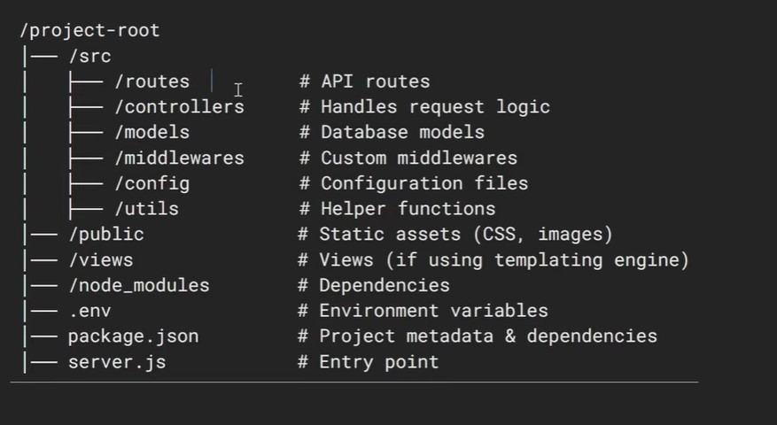

ReactJS Interview Questions:
============================

1. What is React?

```
Answer:
React is a JavaScript library used to build user interfaces, mainly for single-page applications. It allows developers to create reusable UI components.

Explanation:
React focuses only on the view layer (MVC). It uses a virtual DOM to improve performance and updates the UI efficiently.
```
2. What is JSX?

```
Answer:
JSX stands for JavaScript XML. It allows writing HTML-like code inside JavaScript.

Explanation:
JSX is not mandatory, but it makes code more readable. Babel compiles JSX into React.createElement() calls.
```
3. What is the Virtual DOM?

```
Answer:
The Virtual DOM is a lightweight copy of the real DOM.

Explanation:
When state changes, React updates the Virtual DOM first, compares it with the previous version (diffing), and updates only the changed parts in the real DOM—making apps faster.
```

4. What are components in React?

- Components are reusable pieces of UI.
- There are two main types:

    - Functional components
        ```
         function Welcome() {
          return <h1>Hello</h1>;
        }
        ```
    - Class components
        ```
            class Greeting extends Component {
                render() {
                return <h1>Hello, {this.props.name}!</h1>;
                    }
              }
        ```
5. What are props?

- Props are read-only inputs passed from a parent component to a child component.
- They help make components reusable and dynamic.
```
<Welcome name="John" />
```
6. What is state in React?

- State is an object that holds data that can change over time.
    - When state changes, the component re-renders.
```
const [count, setCount] = useState(0);
```
7. Difference between state and props?

| State       | Props         |
| ------------- | ------------- |
| Managed within component  | Passed from parent |
| Can be changed  | Read-only  |
| Causes re-render | Causes re-render |


8. What are React Hooks?

- Hooks are functions that allow using state and lifecycle features in functional components.
- Common hooks:
    - useState
    - useEffect
    - useContext
    - useRef
    - useMemo

9. Explain `useEffect`

- useEffect lets you run side effects in a React component
- A side effect is anything that:
- Examples:
    - fetching data
    - setting up timers
    - subscribing to events
    - updating the document title
- After React renders this component, run this code

- Basic syntax
```
useEffect(() => {
  // effect logic here
}, [dependencies]);
```
- First argument → a function (the effect)
- Second argument → dependency array (controls when it runs)
- Step 1: Runs after every render

```
import { useEffect, useState } from "react";

function Counter() {
  const [count, setCount] = useState(0);

  useEffect(() => {
    console.log("Component rendered");
  });

  return (
    <button onClick={() => setCount(count + 1)}>
      Count: {count}
    </button>
  );
}

```
What happens
- Component renders
- useEffect runs
- Click button → state updates → render again → effect runs again
📌 No dependency array = runs after every render

- Step 2: Run only once (on mount)
```
useEffect(() => {
  console.log("Component mounted");
}, []);
```
- Why this works
- Empty array = “this effect depends on nothing”
- React runs it once after the first render
- Perfect for:
    - API calls
    - event listeners
    - initial setup

- Example:
```
useEffect(() => {
  fetch("/api/users")
    .then(res => res.json())
    .then(data => console.log(data));
}, []);
```
- Step 3: Run when something changes
```
useEffect(() => {
  console.log(`Count changed to ${count}`);
}, [count]);
```

- What this means
- Effect runs only when count changes
- React compares old count vs new count

📌 Rule of thumb:
- If you use a variable inside useEffect, it probably belongs in the dependency array.

- Step 4: Cleanup (important!)
- Some effects need cleanup:
    - timers
    - subscriptions
    - event listeners
```
useEffect(() => {
  const interval = setInterval(() => {
    console.log("Tick");
  }, 1000);

  return () => {
    clearInterval(interval);
  };
}, []);
```
- What’s going on
- Effect runs → sets up interval
- Cleanup runs when:
- component unmounts
 -OR before effect runs again

📌 Think of cleanup as “undo what I did”

10. What is conditional rendering?

- Rendering components based on a condition.
- Syntax:
```
{isLoggedIn ? <Dashboard /> : <Login />}
```
🔹 Advanced React Questions
11. What is lifting state up?

Answer:
- Moving state from a child component to a common parent so multiple components can share it.
- If two (or more) components need the same data, that data should live in their closest common 

- Example:
```
Parent (state)
 ├── Input (updates state)
 └── Display (reads state)
```
- Step 1: Move state to the parent
```
function App() {
  const [name, setName] = React.useState("");

  return (
    <>
      <Input name={name} setName={setName} />
      <Display name={name} />
    </>
  );
}
```

- Step 2: Pass updater function down
```
function Input({ name, setName }) {
  return (
    <input
      value={name}
      onChange={e => setName(e.target.value)}
    />
  );
}
```
- Step 3: Pass state down as props
```
function Display({ name }) {
  return <h1>Hello {name}</h1>;
}
```
12. What is Context API?

- Context API lets you share data globally with many components without passing props manually at every level.

```
It solves this problem 👇

App
 └── Parent
     └── Child
         └── GrandChild (needs data)
```

- Without Context → you’d pass props through every layer (prop drilling).
- With Context → components can tap into the data directly.

- The problem: prop drilling
```
function App() {
  const [user, setUser] = React.useState("Alice");

  return <Parent user={user} />;
}

function Parent({ user }) {
  return <Child user={user} />;
}

function Child({ user }) {
  return <h1>Hello {user}</h1>;
}
```
😵 Parent and Child don’t even use user — they’re just forwarding it.

- Step 1: Create a context
```
import { createContext } from "react";

const UserContext = createContext();
```

// Think of this as creating a data channel.

- Step 2: Provide the context value
- Wrap the part of the app that needs access.

```
function App() {
  const [user, setUser] = React.useState("Alice");

  return (
    <UserContext.Provider value={{ user, setUser }}>
      <Parent />
    </UserContext.Provider>
  );
}
```

📌 Any component inside Provider can now access user.

- Step 3: Consume the context
 - Use useContext where you need the data.
```
import { useContext } from "react";

function Child() {
  const { user } = useContext(UserContext);

  return <h1>Hello {user}</h1>;
}
```
✨ No props passed. Clean.
- Full Example
```
import React, { createContext, useContext, useState } from "react";

const UserContext = createContext();

function App() {
  const [user, setUser] = useState("Alice");

  return (
    <UserContext.Provider value={{ user, setUser }}>
      <Parent />
    </UserContext.Provider>
  );
}

function Parent() {
  return <Child />;
}

function Child() {
  const { user, setUser } = useContext(UserContext);

  return (
    <>
      <h1>Hello {user}</h1>
      <button onClick={() => setUser("Bob")}>Change User</button>
    </>
  );
}
```
- How data flows (important)
    1. App owns the state
    2. Provider shares it
    3. Any child can read or update it
    4. When value changes → all consumers re-render

13. What is prop drilling?

```
Answer:
Passing props through multiple levels of components unnecessarily.

Explanation:
It makes code harder to maintain. Context API or Redux solves this.
```

14. What is Redux?
- Redux is a state management library for JavaScript apps.
- It uses:
    - Store
    - Actions
    - Reducers

- Ensures predictable state management

15. What is reconciliation?

- The process React uses to update the DOM efficiently.
- React compares the new Virtual DOM with the old one and applies minimal updates.

16. What are keys in React?

- Keys help React identify which items have changed in a list.

```
items.map(item => <li key={item.id}>{item.name}</li>)
```
17. What is memoization in React?

- An optimization technique to prevent unnecessary re-renders.

- By below options are memoization technique
    - React.memo
    - useMemo
    - useCallback

18. Difference between useMemo and useCallback?

| useMemo |	useCallback |
|----------|------------|
|Memoizes values|	Memoizes functions|
|Improves performance	|Prevents re-creation of functions|

19. How do you optimize React performance?

    - Use React.memo
    - Avoid unnecessary re-renders
    - Use lazy loading
    - Use keys properly
    - Code splitting

20. Explain `useMemo` and `React.memo`

- useMemo → memoizes a value
- React.memo → memoizes a component
- [React.memo](https://www.youtube.com/watch?v=QoJplQlMP2Y&t=897s)
- [useMemo](https://www.youtube.com/watch?v=IlzjNhtUqOs)
- [useCallBack](https://www.youtube.com/watch?v=apjSe464KWk)
#### Part 1: useMemo

- What problem does it solve?
- It prevents expensive calculations from running on every render.

- Step 1: The problem (expensive calculation)
```
import React, { useState,useMemo } from 'react';

function App() {
  const [count, setCount] = useState(5);
  const [darkMode, setDarkMode] = useState(false);

  // 1. A simulated expensive mathematical operation
const computedValue =useMemo(() =>{
  const expensiveCalculation = (num) => {
    console.log("🔥 Running heavy calculation loop...");
    let result = num;
    for (let i = 0; i < 1000000000; i++) {
      // Wasting CPU cycles intentionally to simulate a laggy process
    }
    return result * 2;
  };

  // 2. This runs on EVERY SINGLE RENDER cycle
   return expensiveCalculation(count);

},[count])
  return (
    <div style={{ background: darkMode ? '#333' : '#fff', color: darkMode ? '#fff' : '#000', padding: '20px' }}>
      <h1>Value: {computedValue}</h1>
      <br />
      {/* Changing count runs the calculation (Expected) */}
      <button onClick={() => setCount(count + 1)}>Increment Count</button>
      <br />
      {/* CRASH/LAG RISK: Changing the theme also runs the calculation! */}
      <button onClick={() => setDarkMode(!darkMode)}>
        Toggle Theme (Current: {darkMode ? "Dark" : "Light"})
      </button>
    </div>
  );
}

export default App;
```

- What happens now?

- Input changes → re-render
- useMemo returns cached value
- slowFunction does not run again
- count changes → recalculates

- Rules for useMemo

✅ Use when:

- calculation is expensive

- value depends on specific inputs

❌ Don’t use for:

- simple calculations

- everything “just in case”

📌 Overusing useMemo can hurt performance.

- Explain `useCallback` and `React.memo`
  - [Refer this link for better clarity](https://www.youtube.com/watch?v=zkWIVj5EsuI)

- Explain `useMemo`
 - [useMemo] (https://www.youtube.com/watch?v=RIFYIfzarnI)

- `useCallback` example

```
import React, { useState,useCallback } from 'react';

// An optimized child component wrapped in React.memo
const Button = React.memo(({ handleClick, children }) => {
  console.log(`🔥 Child ${children} component re-rendered!`);
  return <button onClick={handleClick}>{children}</button>;
});

function App() {
  const [count, setCount] = useState(0);
  const [text, setText] = useState("");

  // // This function is recreated on EVERY SINGLE RENDER
  // const increment = () => {
  //   setCount((prevCount) => prevCount + 1);
  // };

  // 🔥 THE FIX: Memoize the function definition
  // We use the functional state updater form (prevCount => prevCount + 1)
  // so that this function doesn't need 'count' in its dependency array.
  const increment = useCallback(() => {
    setCount((prevCount) => prevCount + 1);
  }, []); // Empty dependency array means this function reference never changes!

  return (
    <div style={{ padding: '20px' }}>
      <h1>Count: {count}</h1>
      
      {/* Typing here recreates 'increment', causing the button to re-render! */}
      <input 
        type="text" 
        value={text} 
        onChange={(e) => setText(e.target.value)} 
        placeholder="Type here..." 
      />
      
      <br /><br />
      <Button handleClick={increment}>Increment Count</Button>
    </div>
  );
}

export default App;
```

- Lazy Loading
  - Lazy Loading Routes (Code Splitting)
  - Lazy loading improves performance by loading components only when needed, reducing initial bundle size.

```
📌 Example using React.lazy and Suspense
import React, { Suspense, lazy } from "react";
import { BrowserRouter as Router, Routes, Route } from "react-router-dom";

// Lazy loaded components
const Dashboard = lazy(() => import("./Dashboard"));
const Reports = lazy(() => import("./Reports"));

function App() {
  return (
    <Router>
      <Suspense fallback={<div>Loading...</div>}>
        <Routes>
          <Route path="/dashboard" element={<Dashboard />} />
          <Route path="/reports" element={<Reports />} />
        </Routes>
      </Suspense>
    </Router>
  );
}

export default App;
```

- Debouncing Search Input
- Debouncing ensures an API call happens after the user stops typing, preventing excessive requests.
- Debounce is a technique that delays executing a function until after a user has stopped triggering it for a specified time.
```
📌 Example Using setTimeout
import React, { useState, useEffect } from "react";

function SearchComponent() {
  const [query, setQuery] = useState("");
  const [debouncedQuery, setDebouncedQuery] = useState("");

  useEffect(() => {
    const timer = setTimeout(() => {
      setDebouncedQuery(query);
    }, 500); // 500ms delay

    return () => clearTimeout(timer);
  }, [query]);

  useEffect(() => {
    if (debouncedQuery) {
      console.log("API Call with:", debouncedQuery);
      // Call API here
    }
  }, [debouncedQuery]);

  return (
    <input
      type="text"
      placeholder="Search..."
      value={query}
      onChange={(e) => setQuery(e.target.value)}
    />
  );
}

export default SearchComponent;

✅ What This Does:

Waits 500ms after user stops typing

Prevents multiple API calls

Reduces server load

Improves performance
```
- I implemented input debouncing using useEffect and setTimeout to prevent excessive API calls and improve search performance.

- Here’s a clear example of Debouncing using Lodash in React 👇

✅ 1️⃣ Install Lodash
npm install lodash

✅ 2️⃣ Example: Debounced Search Input Using Lodash

```
import React, { useState, useMemo } from "react";
import { debounce } from "lodash";

function SearchComponent() {
  const [query, setQuery] = useState("");

  // Create debounced function
  const debouncedSearch = useMemo(() => 
    debounce((value) => {
      console.log("API Call with:", value);
      // Call your API here
    }, 500), []
  );

  const handleChange = (e) => {
    const value = e.target.value;
    setQuery(value);
    debouncedSearch(value);
  };

  return (
    <input
      type="text"
      value={query}
      onChange={handleChange}
      placeholder="Search..."
    />
  );
}

export default SearchComponent;
```
- Why use useMemo?
  - Prevents recreating the debounced function on every render
  - Improves performance
  - Ensures stable function reference

  
  1️⃣ Install Lodash (if not installed)
npm install lodash

✅ 2️⃣ Example: Throttling Scroll Event

This example ensures the function runs at most once every 500ms, even if the user scrolls continuously.
```
import React, { useEffect, useMemo } from "react";
import { throttle } from "lodash";

function ScrollTracker() {

  const handleScroll = useMemo(
    () =>
      throttle(() => {
        console.log("Scroll position:", window.scrollY);
      }, 500),
    []
  );

  useEffect(() => {
    window.addEventListener("scroll", handleScroll);

    return () => {
      window.removeEventListener("scroll", handleScroll);
      handleScroll.cancel(); // cleanup
    };
  }, [handleScroll]);

  return <div style={{ height: "2000px" }}>Scroll Down</div>;
}

export default ScrollTracker;
```
✅ What This Does
- If user scrolls continuously → function runs once every 500ms
- Prevents performance issues
- Useful for scroll tracking, resize events, infinite scroll

🎯 Interview Explanation (Short & Strong)

I used Lodash throttle to control the execution frequency of scroll events, ensuring the function runs at fixed intervals instead of triggering excessively. This improved performance and prevented unnecessary re-renders during continuous user interactions.

🔥 Difference Reminder
- Debounce → Wait until user stops
- Throttle → Execute at fixed intervals

- Find last value for count
```
import React,{useState,useEffect,useRef} from 'react'

export default function App() {
 const [count,setCount] = useState(0);
 const lastValue= useRef(0);

 useEffect(()=>{
    lastValue.current=count
 },[count])
const handleIncrement= ()=>{
  setCount(count+5)
}
  return (<>
        <h1>{count}</h1>
        <h2>{lastValue.current}</h2>
        <button onClick={handleIncrement}>increment</button>
  </>)
}
```
- [Role based access routing](https://www.youtube.com/watch?v=SKF--l-FGNM)

- useReducer
  - While useState is great for simple values, useReducer is the "big guns" for managing complex state—especially when the next state depends on the previous one or involves multiple sub-values.

```
import React, { useReducer } from 'react';

// 1. Define the initial state
const initialState = { items: [], total: 0 };

// 2. Define the reducer function
function cartReducer(state, action) {
  switch (action.type) {
    case 'ADD_ITEM':
      return {
        ...state,
        items: [...state.items, action.payload],
        total: state.total + action.payload.price
      };
    case 'REMOVE_ITEM':
      const filteredItems = state.items.filter(item => item.id !== action.payload.id);
      return {
        ...state,
        items: filteredItems,
        total: state.total - action.payload.price
      };
    case 'CLEAR_CART':
      return initialState;
    default:
      return state;
  }
}

export default function ShoppingCart() {
  // 3. Initialize useReducer
  const [state, dispatch] = useReducer(cartReducer, initialState);

  const addItem = () => {
    const newItem = { id: Date.now(), name: 'Coffee', price: 5 };
    dispatch({ type: 'ADD_ITEM', payload: newItem });
  };

  return (
    <div>
      <h2>Cart Total: ${state.total}</h2>
      <button onClick={addItem}>Add Coffee ($5)</button>
      <button onClick={() => dispatch({ type: 'CLEAR_CART' })}>Clear</button>

      <ul>
        {state.items.map(item => (
          <li key={item.id}>
            {item.name} - ${item.price} 
            <button onClick={() => dispatch({ type: 'REMOVE_ITEM', payload: item })}>
              x
            </button>
          </li>
        ))}
      </ul>
    </div>
  );
}
```
- display state based on country

```
import React, { useState } from "react";

const locationData = [
  {
    country: "USA",
    states: ["California", "Texas", "Florida", "New York"]
  },
  {
    country: "India",
    states: ["Maharashtra", "Karnataka", "Tamil Nadu", "Delhi"]
  },
  {
    country: "Canada",
    states: ["Ontario", "Quebec", "Alberta", "British Columbia"]
  }
];

export default function CountryStateSelector() {
  const [selectedCountry, setSelectedCountry] = useState("");
  const [availableStates, setAvailableStates] = useState([]);

  const handleCountryChange = (e) => {
    const countryName = e.target.value;
    setSelectedCountry(countryName);

    // Find the object that matches the selected country
    const countryObj = locationData.find((c) => c.country === countryName);
    
    // Update the states list (or clear it if no country is selected)
    setAvailableStates(countryObj ? countryObj.states : []);
  };

  return (
    <div style={{ padding: "20px", fontFamily: "Arial" }}>
      <h3>Select Location</h3>

      {/* Country Dropdown */}
      <select value={selectedCountry} onChange={handleCountryChange}>
        <option value="">-- Select Country --</option>
        {locationData.map((item) => (
          <option key={item.country} value={item.country}>
            {item.country}
          </option>
        ))}
      </select>

      <br /><br />

      {/* State Dropdown */}
      <select disabled={!selectedCountry}>
        <option value="">-- Select State --</option>
        {availableStates.map((state) => (
          <option key={state} value={state}>
            {state}
          </option>
        ))}
      </select>
    </div>
  );
}
```
- How to load all api's info in the UI with out pagination?
-  we can achieve it by virtual-scroll(js code) or react-virtualized library
- react-virtualized library usage
```
import React, { useState, useEffect } from 'react';
import axios from 'axios';
import { List, AutoSizer } from 'react-virtualized';
import 'react-virtualized/styles.css'; // Essential for default styling

const Demo = () => {
  const [data, setData] = useState([]);

  useEffect(() => {
    // Fetching 100 items from JSONPlaceholder
    axios.get('https://jsonplaceholder.typicode.com/posts')
      .then(res => setData(res.data));
  }, []);

  // This function renders a single row
  const rowRenderer = ({ index, key, style }) => {
    const item = data[index];
    
    return (
      <div key={key} style={{
        ...style,
        display: 'flex',
        alignItems: 'center',
        padding: '0 10px',
        borderBottom: '1px solid #ddd',
        backgroundColor: index % 2 === 0 ? '#fff' : '#f9f9f9'
      }}>
        <div>
          <strong>{index + 1}.</strong> {item.title}
        </div>
      </div>
    );
  };

  return (
    <div style={{ height: '80vh', width: '100%', padding: '20px' }}>
      <h3>React Virtualized List (100 Items)</h3>
      
      {/* AutoSizer calculates the parent's width/height automatically */}
      <AutoSizer>
        {({ height, width }) => (
          <List
            width={width}
            height={height}
            rowCount={data.length}
            rowHeight={60} // Fixed height of each row in pixels
            rowRenderer={rowRenderer}
            overscanRowCount={10} // Pre-renders 10 rows for smoother scrolling
          />
        )}
      </AutoSizer>
    </div>
  );
};

export default Demo;
```
- virtual scroll also will help to load limited data in the ui
```
import React, { useState, useRef, useMemo, useEffect, useCallback } from 'react';

const VirtualScroll = ({ items, itemHeight, containerHeight }) => {
  const [scrollTop, setScrollTop] = useState(0);
  const containerRef = useRef(null);
  const frameId = useRef(null);

  // 1. Optimized Scroll Handler
  const onScroll = useCallback((e) => {
    // Cancel the previous frame to prevent "stacking" updates
    if (frameId.current) {
      cancelAnimationFrame(frameId.current);
    }

    // Schedule the state update for the next browser repaint
    frameId.current = requestAnimationFrame(() => {
      setScrollTop(e.target.scrollTop);
    });
  }, []);

  // 2. Cleanup on unmount
  useEffect(() => {
    return () => {
      if (frameId.current) cancelAnimationFrame(frameId.current);
    };
  }, []);

  // 3. Logic for visible range
  const { startWithBuffer, endWithBuffer, visibleItems } = useMemo(() => {
    const startIndex = Math.floor(scrollTop / itemHeight);
    const endIndex = Math.min(
      items.length - 1,
      Math.floor((scrollTop + containerHeight) / itemHeight)
    );

    const buffer = 5;
    const startWithBuffer = Math.max(0, startIndex - buffer);
    const endWithBuffer = Math.min(items.length - 1, endIndex + buffer);

    const sliced = items.slice(startWithBuffer, endWithBuffer + 1).map((item, i) => ({
      ...item,
      absoluteIndex: startWithBuffer + i,
    }));

    return { startWithBuffer, endWithBuffer, visibleItems: sliced };
  }, [items, scrollTop, itemHeight, containerHeight]);

  return (
    <div
      ref={containerRef}
      onScroll={onScroll}
      style={{
        height: containerHeight,
        overflowY: 'auto',
        position: 'relative',
        border: '1px solid #ccc',
        willChange: 'transform', // Optimization hint for the browser
      }}
    >
      {/* 4. The "Total Height" div to force scrollbar appearance */}
      <div 
        style={{ 
          height: items.length * itemHeight, 
          width: '100%',
          pointerEvents: 'none' // Prevent interaction with the phantom div
        }} 
      />

      {/* 5. The "View Window" that translates with the scroll */}
      <div
        style={{
          position: 'absolute',
          top: 0,
          left: 0,
          width: '100%',
          // Use translateY for GPU-accelerated performance
          transform: `translate3d(0, ${startWithBuffer * itemHeight}px, 0)`,
        }}
      >
        {visibleItems.map((item) => (
          <div
            key={item.id || item.absoluteIndex} // Use unique ID if available
            style={{
              height: itemHeight,
              padding: '10px',
              borderBottom: '1px solid #eee',
              boxSizing: 'border-box',
              display: 'flex',
              alignItems: 'center'
            }}
          >
            <strong>{item.absoluteIndex + 1}.</strong>&nbsp;{item.title}
          </div>
        ))}
      </div>
    </div>
  );
};

export default VirtualScroll;
```
- How to load high-priority child components first, and render the remaining components later?
  - In high-performance React applications, this pattern is known as `Progressive Rendering` or `Priority-Based Hydration`. The goal is to ensure the user sees the "Main" or "Critical" content immediately, while the secondary, non-critical components (like footers, sidebars, or complex widgets) load in the background.

1. Using `React.Suspense` and `lazy` (Best for Bundles)
 - This is the standard approach for splitting your code. You can prioritize the "Main" component by importing it normally and lazy-loading the others.
 ```
 import React, { Suspense, lazy } from 'react';
import CriticalComponent from './CriticalComponent'; // Priority 1: Loaded immediately

// Priority 2: Loaded later as a separate bundle
const DelayedComponent = lazy(() => import('./DelayedComponent'));

const Parent = () => {
  return (
    <div>
      {/* Priority child renders instantly */}
      <CriticalComponent />

      {/* Remaining children load in background */}
      <Suspense fallback={<div>Loading secondary content...</div>}>
        <DelayedComponent />
      </Suspense>
    </div>
  );
};
```
2. Using `useEffect` to Defer Rendering (Best for Execution)
- If the components are already in the bundle but are computationally heavy, you can defer their mounting using a simple state-based delay. This ensures the main thread finishes rendering the priority child before starting the others.
```
import React, { useState, useEffect } from 'react';

const Parent = () => {
  const [shouldLoadSecondary, setShouldLoadSecondary] = useState(false);

  useEffect(() => {
    // Wait until the initial render of the Critical component is finished
    const timeout = setTimeout(() => {
      setShouldLoadSecondary(true);
    }, 0); // Even a 0ms delay pushes it to the end of the event loop

    return () => clearTimeout(timeout);
  }, []);

  return (
    <div>
      <CriticalComponent />
      
      {shouldLoadSecondary ? (
        <HeavyChildComponent />
      ) : (
        <Placeholder />
      )}
    </div>
  );
};
```
3. Using `requestIdleCallback` (Best for UX Scale)
- For a "Proper" enterprise implementation, you should use the browser's requestIdleCallback. This API waits until the browser is literally idle (done with priority tasks) before rendering the low-priority children.
```
import React, { useState, useEffect } from 'react';

const PriorityLoader = () => {
  const [lowPriorityItems, setLowPriorityItems] = useState(false);

  useEffect(() => {
    // requestIdleCallback is a global Web API like requestAnimationFrame
    if ('requestIdleCallback' in window) {
      window.requestIdleCallback(() => {
        setLowPriorityItems(true);
      });
    } else {
      // Fallback for Safari/browsers that don't support it yet
      setTimeout(() => setLowPriorityItems(true), 1000);
    }
  }, []);

  return (
    <div>
      <HighPriorityHeader />
      
      {lowPriorityItems && (
        <>
          <HeavyDashboardWidgets />
          <FooterLinks />
        </>
      )}
    </div>
  );
};
```
- controlled vs uncontrolled components
 - In a Controlled component, React state manages the form data.
 - In an Uncontrolled component, the DOM itself holds the form data, and you pull it out when you need it using a React ref.

1. Controlled Component Example (React State)
 - In a controlled component, every single keystroke triggers a state update. The input element's value attribute is locked directly to a React useState variable.
 ```
 import React, { useState } from 'react';

export default function ControlledForm() {
  const [username, setUsername] = useState('');

  const handleChange = (event) => {
    // Sync the input text with React state on every single keystroke
    setUsername(event.target.value);
  };

  const handleSubmit = (event) => {
    event.preventDefault();
    console.log("Submitted Username:", username); 
  };

  return (
    <form onSubmit={handleSubmit}>
      <label>
        Username (Controlled):
        <input 
          type="text" 
          value={username} 
          onChange={handleChange} 
        />
      </label>
      <button type="submit">Submit</button>
      
      {/* Live feedback is easy because React constantly knows the value */}
      <p>Current input text length: {username.length}</p>
    </form>
  );
}
```

2. Uncontrolled Component Example (DOM Refs)
 - In an uncontrolled component, you don't track the typing changes. The input manages its own internal state in the browser DOM. When you finally submit the form, you reach into the DOM using a useRef pointer to grab whatever text happens to be sitting there.

 ```
 import React, { useRef } from 'react';

export default function UncontrolledForm() {
  // Create a pointer reference to hold the DOM element
  const inputRef = useRef(null);

  const handleSubmit = (event) => {
    event.preventDefault();
    // Grab the value directly from the DOM node when needed
    console.log("Submitted Username:", inputRef.current.value);
  };

  return (
    <form onSubmit={handleSubmit}>
      <label>
        Username (Uncontrolled):
        <input 
          type="text" 
          ref={inputRef} // Attaches the DOM node to our ref pointer
        />
      </label>
      <button type="submit">Submit</button>
    </form>
  );
}
```
- Promise vs async/await
-  What's the difference and when would you prefer one over the other?
  - async/await is syntactic sugar over Promises, more readable
  - Promise.all for parallel execution, async/await for sequential
  - Use async/await with try/catch for better error handling
  - Use Promise.allSettled when you need all results regardless of failures

- What does "scalable web applications" mean in your experience?

  - Handle increasing user traffic without performance degradation
  - Code splitting and lazy loading for faster initial load
  - CDN integration for static assets
  - Service workers for offline capability
  - Micro-frontends for team scalability
  - Caching strategies (SWR, React Query)

- Where exactly did you use virtualization in your projects?
1. Data Tables & Grids (Most Common)
Scenario: Enterprise dashboards with thousands of records
```
// Real example: Customer management system with 10,000+ customers
// Problem: Initial render took 8 seconds, scrolling was laggy
// Solution: Implemented react-window virtualization
// Result: Render time dropped to 200ms, smooth 60fps scrolling

import { FixedSizeList } from 'react-window';

const CustomerTable = ({ customers }) => (
  <FixedSizeList
    height={600}
    itemCount={customers.length} // 10,000+ items
    itemSize={50}
    width="100%"
  >
    {({ index, style }) => (
      <CustomerRow customer={customers[index]} style={style} />
    )}
  </FixedSizeList>
);
```
2. Chat/Messaging Applications
Scenario: Chat history with thousands of messages
```
// Real example: Customer support chat system
// Problem: Loading 50,000 message history crashed the browser
// Solution: Virtualized message list with infinite scroll
// Result: Only 30 messages rendered at a time, memory usage reduced 95%

import React from 'react';
import { AutoSizer, VariableList, ListRowProps } from 'react-virtualized';
import './ChatWindow.css';

interface Message {
  id: string;
  text: string;
  isLong: boolean;
  sender: string;
  timestamp: Date;
}

interface ChatWindowProps {
  messages: Message[];
}

const ChatWindow: React.FC<ChatWindowProps> = ({ messages }) => {
  const rowRenderer = ({ index, key, style }: ListRowProps) => {
    const message = messages[index];
    return (
      <MessageBubble key={key} message={message} style={style} />
    );
  };

  return (
    <div className="chat-window">
      <AutoSizer>
        {({ height, width }) => (
          <VariableList
            height={height}
            width={width}
            rowCount={messages.length}
            rowHeight={index => messages[index]?.isLong ? 200 : 40}
            rowRenderer={rowRenderer}
            overscanRowCount={10}
            scrollToIndex={messages.length - 1}
            scrollToAlignment="end"
          />
        )}
      </AutoSizer>
    </div>
  );
};

// Message Bubble Component
const MessageBubble: React.FC<{ message: Message; style: React.CSSProperties }> = 
  ({ message, style }) => {
    return (
      <div style={style} className={`message-bubble ${message.sender}`}>
        <div className="message-text">{message.text}</div>
        <div className="message-time">
          {message.timestamp.toLocaleTimeString()}
        </div>
      </div>
    );
  };

export default ChatWindow;
```
- 

#### `useParams`
- URL parameters (often called path params) are part of the actual URL path. They act as placeholders in your route definitions.
- How it looks in code (React Router Example) 
  - First, you define the route with a colon (:) to mark the dynamic part:
```
<Route path="/user/:userId" element={<UserProfile />} />
```
##### Example:

1. The Main Router Setup (`App.jsx`)
- This component manages your routes. It maps the root URL (`/`) to your list and the dynamic path (`/product/:id`) to your separate detail view.
```
import React from 'react';
import { BrowserRouter, Routes, Route } from 'react-router-dom';
import ProductList from './ProductList';
import ProductDetail from './ProductDetail';

function App() {
  return (
    <BrowserRouter>
      <div style={{ padding: '20px', fontFamily: 'sans-serif' }}>
        <h1>My E-Commerce App</h1>
        <hr />
        
        <Routes>
          {/* Main Page showing list of products */}
          <Route path="/" element={<ProductList />} />
          
          {/* Separate dynamic route that receives the ID parameter */}
          <Route path="/product/:productId" element={<ProductDetail />} />
        </Routes>
      </div>
    </BrowserRouter>
  );
}

export default App;
```

2. The Selection Component (`ProductList.jsx`)
- Instead of updating local state inside the same file, we now use the React Router `Link` component (or the `useNavigate` hook) to push the user to a completely separate URL.

```
import React from 'react';
import { Link } from 'react-router-dom';

const ProductList = () => {
  // Mock list of products. Selecting any of these will trigger navigation.
  const products = [
    { id: 1, name: 'Wireless Headphones' },
    { id: 2, name: 'Mechanical Keyboard' },
    { id: 3, name: 'Gaming Mouse' }
  ];

  return (
    <div>
      <h2>Available Products</h2>
      <ul style={{ listStyleType: 'none', padding: 0 }}>
        {products.map((product) => (
          <li key={product.id} style={{ margin: '10px 0' }}>
            {/* Navigates to a brand new route matching our dynamic URL structure */}
            <Link 
              to={`/product/${product.id}`} 
              style={{ textDecoration: 'none', color: '#007bff', fontWeight: 'bold' }}
            >
              View Details for {product.name} (ID: {product.id}) →
            </Link>
          </li>
        ))}
      </ul>
    </div>
  );
};

export default ProductList;
```
3. The Isolated Detail Component (`ProductDetail.jsx`)
- This component is completely blank until it is mounted by the Router. It uses `useParams()` to pull the productId out of the URL bar, and then cleanly executes its own fetch request isolated from the list view.

```
import React, { useState, useEffect } from 'react';
import { useParams, Link } from 'react-router-dom';

// Replacing sample user endpoint with a product endpoint simulation
const API_BASE_URL = 'https://dummyjson.com/products';

const ProductDetail = () => {
  // 1. Extract the productId variable directly from the browser URL parameter
  const { productId } = useParams();
  
  const [product, setProduct] = useState(null);
  const [loading, setLoading] = useState(false);
  const [error, setError] = useState(null);

  useEffect(() => {
    const fetchProductData = async () => {
      setLoading(true);
      setError(null);
      
      try {
        const response = await fetch(`${API_BASE_URL}/${productId}`);
        
        if (!response.ok) {
          throw new Error(`Error: ${response.status} - Could not retrieve product data.`);
        }
        
        const jsonResult = await response.json();
        setProduct(jsonResult);
      } catch (err) {
        setError(err.message);
      } finally {
        setLoading(false);
      }
    };

    if (productId) {
      fetchProductData();
    }
  }, [productId]); // Triggers when the component mounts with the URL's specific ID

  // UI State feedback
  if (loading) return <h3>🔄 Fetching isolated product details from API...</h3>;
  if (error) return <div style={{ color: 'red' }}>⚠️ {error}</div>;
  if (!product) return <p>No product found.</p>;

  return (
    <div style={{ border: '1px solid #ddd', padding: '20px', borderRadius: '8px', maxWidth: '500px' }}>
      {/* Back navigation button */}
      <Link to="/" style={{ display: 'inline-block', marginBottom: '15px', color: '#555' }}>
        ← Back to Product Selection
      </Link>

      <h2>{product.title}</h2>
      <p style={{ color: '#666', fontStyle: 'italic' }}>Category: {product.category}</p>
      <hr />
      
      <p><strong>Description:</strong> {product.description}</p>
      <p><strong>Price:</strong> ${product.price}</p>
      <p><strong>Rating:</strong> {product.rating} / 5</p>
      <p><strong>Stock Status:</strong> {product.stock > 0 ? 'In Stock' : 'Out of Stock'}</p>
    </div>
  );
};

export default ProductDetail;
```
#### searchparams/querystring `useSearchParams`

- Query parameters (or search params) are extensions appended to the end of a URL. They don't change the core route structure; instead, they pass extra instructions or state to the page.

- How it looks in code (React Router Example)
- If a user navigates to `/shop?category=books&page=2`, you use `useSearchParams` to read those values:

```
import { useSearchParams } from 'react-router-dom';

function Shop() {
  const [searchParams] = useSearchParams();
  
  const category = searchParams.get('category'); // "books"
  const page = searchParams.get('page'); // "2"

  return <div>Showing {category} on page {page}</div>;
}
```
##### Note: In vanilla JavaScript without a framework, you can grab these using new URLSearchParams(window.location.search).
- Best Used For:
  - Filtering data (e.g., ?color=blue&size=M).
  - Sorting data (e.g., ?sort=price_low_to_high).
  - Pagination (e.g., ?page=3).
  - Tracking or UTM codes (e.g., ?utm_source=newsletter).

##### Example

1. The Main Router Setup (`App.jsx`)
- Notice how the route is now a clean, static path (`/product`). It doesn’t need a special `:productId` placeholder anymore, because search parameters are read dynamically from whatever follows the ? in the URL.

```
import React from 'react';
import { BrowserRouter, Routes, Route } from 'react-router-dom';
import ProductSearchList from './ProductSearchList';
import ProductQueryDetail from './ProductQueryDetail';

function App() {
  return (
    <BrowserRouter>
      <div style={{ padding: '20px', fontFamily: 'sans-serif' }}>
        <h1>Query String API Fetch Example</h1>
        <hr />
        
        <Routes>
          <Route path="/" element={<ProductSearchList />} />
          {/* Static route structure. The query string handles the rest */}
          <Route path="/product" element={<ProductQueryDetail />} />
        </Routes>
      </div>
    </BrowserRouter>
  );
}

export default App;
```
2. The Selection Component (`ProductSearchList.jsx`)
- When constructing your `Link` elements, you append the `?id=VALUE` syntax directly to the end of your target pathname.

```
import React from 'react';
import { Link } from 'react-router-dom';

const ProductSearchList = () => {
  const items = [
    { id: 4, name: 'Sleek Laptop' },
    { id: 5, name: '4K Monitor' },
    { id: 6, name: 'Ergonomic Chair' }
  ];

  return (
    <div>
      <h2>Select an Item (Query String Method)</h2>
      <ul style={{ listStyleType: 'none', padding: 0 }}>
        {items.map((item) => (
          <li key={item.id} style={{ margin: '10px 0' }}>
            {/* Directing to /product?id=number */}
            <Link 
              to={`/product?id=${item.id}`} 
              style={{ textDecoration: 'none', color: '#28a745', fontWeight: 'bold' }}
            >
              Inspect {item.name} (?id={item.id}) →
            </Link>
          </li>
        ))}
      </ul>
    </div>
  );
};

export default ProductSearchList;
```
3. The Detail Component via Query Strings (`ProductQueryDetail.jsx`)
- Here, we use `useSearchParams()`. It returns an array containing a searchParams object. You use its `.get('key')` method to extract the specific parameter you want out of the URL string.

```
import React, { useState, useEffect } from 'react';
import { useSearchParams, Link } from 'react-router-dom';

const API_BASE_URL = 'https://dummyjson.com/products';

const ProductQueryDetail = () => {
  // 1. Initialize searchParams hook
  const [searchParams] = useSearchParams();
  
  // 2. Safely extract the 'id' parameter value from "?id=X"
  const itemId = searchParams.get('id');

  const [item, setItem] = useState(null);
  const [loading, setLoading] = useState(false);
  const [error, setError] = useState(null);

  useEffect(() => {
    // If someone accidentally browsed to /product with no query string, stop.
    if (!itemId) return;

    const fetchQueryData = async () => {
      setLoading(true);
      setError(null);
      
      try {
        const response = await fetch(`${API_BASE_URL}/${itemId}`);
        
        if (!response.ok) {
          throw new Error(`HTTP Error ${response.status}: Failed to grab query item.`);
        }
        
        const jsonResult = await response.json();
        setItem(jsonResult);
      } catch (err) {
        setError(err.message);
      } finally {
        setLoading(false);
      }
    };

    fetchQueryData();
  }, [itemId]); // Fires whenever the '?id=' portion of the URL updates

  // UI Feedback States
  if (!itemId) return <p style={{ color: 'orange' }}>⚠️ No ID was specified in the URL query string.</p>;
  if (loading) return <h3>🔄 Fetching data parsing URL search parameters...</h3>;
  if (error) return <div style={{ color: 'red' }}>⚠️ Error: {error}</div>;
  if (!item) return <p>Data not found.</p>;

  return (
    <div style={{ border: '2px dashed #28a745', padding: '20px', borderRadius: '8px', maxWidth: '500px' }}>
      <Link to="/" style={{ display: 'inline-block', marginBottom: '15px', color: '#555' }}>
        ← Back to Search List
      </Link>

      <div style={{ background: '#f4f4f4', padding: '5px 10px', fontSize: '12px', borderRadius: '4px' }}>
        <strong>Current Parsed URL State:</strong> ?id={itemId}
      </div>

      <h2>{item.title}</h2>
      <p><strong>Brand:</strong> {item.brand || 'Generic'}</p>
      <p><strong>Price:</strong> ${item.price}</p>
      <p><strong>Description:</strong> {item.description}</p>
    </div>
  );
};

export default ProductQueryDetail;
```

### URL Parameters vs. Query Strings

| Pattern | URL Structure | Best Used For... | Hook Used |
| :--- | :--- | :--- | :--- |
| **URL Params** | `/product/2` | Core entity views, essential structural identifiers, deep linking. | `useParams()` |
| **Search/Query Params** | `/product?id=2` | Optional filters, sorting preferences, search tracking, pagination (`?page=3&sort=desc`). | `useSearchParams()` |